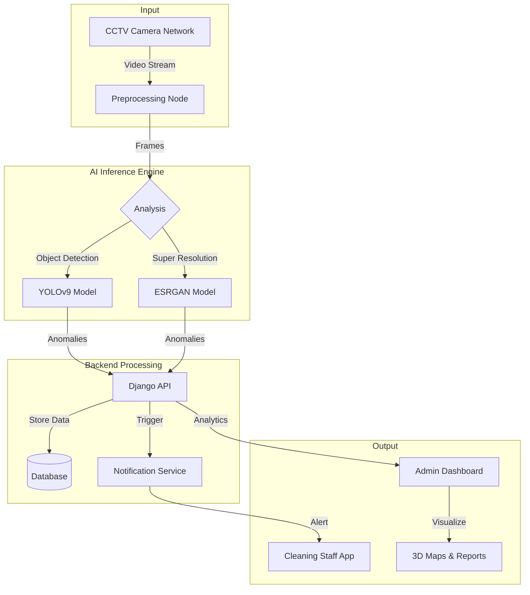
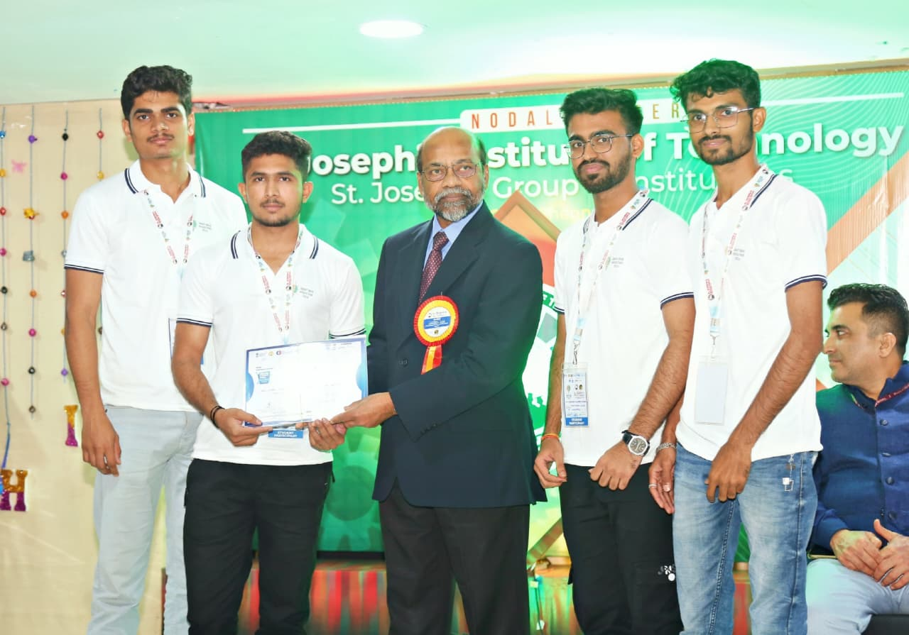

<div align="center">

  
  <br/>

  # 🏆 ShuddhiNetra Nirikshak
  ### AI-Driven Cleanliness Monitoring System
  
  **Team TERMINATORS | Smart India Hackathon 2024**

  [](https://sih.gov.in)
  [](https://github.com/Atoleanantha)
  [](#)
  [](#)
  [](LICENSE)

  <p>
    <a href="https://shuddinetrasih1751.icipamrutvahini.in/"><b>🌐 Live Prototype</b></a> •
    <a href="https://youtu.be/AvnI_TFHcHY?si=vH3_ij6yC5JE1xNs"><b>📺 Video Demo</b></a> •
    <a href="assets/docs/presentation.pptx"><b>📊 Pitch Deck</b></a> •
    <a href="https://github.com/Atoleanantha/SIH_Shuddhi_Netra.git"><b>💻 Source Code</b></a>
  </p>

</div>

---

## 📖 Table of Contents
- [🚀 Project Overview](#-project-overview)
- [✨ Key Features](#-key-features)
- [🛠️ Technology Stack](#-technology-stack)
- [🏗️ System Architecture](#-system-architecture)
- [📂 Project Structure](#-project-structure)
- [📑 Documents & Reports](#-documents--reports)
- [🏅 Certificates & Achievements](#-certificates--achievements)
- [👥 Team Terminators](#-team-terminators)
- [⚙️ Installation & Setup](#-installation--setup)

---

## 🚀 Project Overview

**ShuddhiNetra Nirikshak** is a cutting-edge **AI-powered surveillance system** engineered for the **Department of Posts** to revolutionize Swachhta (cleanliness) and LiFE (Lifestyle for Environment) monitoring.

Leveraging existing CCTV infrastructure, our system deploys **Computer Vision (YOLOv9)** to autonomously detect garbage, segregation violations, and environmental anomalies in real-time. It empowering Divisional Officers with a **centralized dashboard** to monitor compliance, trigger instant alerts, and generate data-driven insights for a cleaner, greener India.

> **Problem Statement Title:** Dashboard for Swachhta and LiFE  
> **Theme:** Clean & Green Technology

---

## ✨ Key Features

| Feature | Description |
| :--- | :--- |
| **🤖 AI-Powered Detection** | Real-time identification of waste (plastic, paper, metal) using **YOLOv9** with strided inference. |
| **🔍 Tiny Object Recon** | Optimized algorithms to detect small litter items often missed by standard surveillance models. |
| **📄 Smart Doc Verification** | Integration of **ESRGAN** (Super Resolution) to clarify text/digits in low-resolution video feeds. |
| **📊 Central Command** | A unified dashboard for Divisional Officers to monitor multiple Post Offices simultaneously. |
| **📍 Geotagged Alerts** | Instant visual alerts with precise timestamps and location data for rapid response. |
| **📈 Waste Analytics** | Comprehensive reports with "hotspot" analysis using **KNN & Chameleon Clustering**. |
| **� Route Optimization** | AI-driven route planning using **Google Maps API** & **OR-Tools** for efficient waste collection. |

---

## 🛠️ Technology Stack

<div align="center">

| **Frontend** | **Backend** | **AI / ML** | **Database & Cloud** |
| :---: | :---: | :---: | :---: |
|  |  |  |  |
|  |  |  |  |
| **Folium Maps** | **DRF** | **PyTorch** | **Google Maps API** |

</div>

---

## 🏗️ System Architecture



---

## 📂 Project Structure

```bash
ShudhiNetra-Nirikshak/
├── backend/                  # Django Backend Logic
│   ├── post_office/          # Office Management
│   ├── waste_management/     # Waste Analytics APIs
│   └── users/                # Auth & Role Management
│
├── frontend/                 # React User Interface
│   ├── src/components/       # UI Components
│   └── src/services/         # API Integrations
│
├── assets/                   # Project Resources
│   ├── team/                 # Team Photos & Logos
│   ├── docs/                 # Reports & Presentations
│   └── certificates/         # Achievements
│
└── README.md                 # Documentation (You are here!)
```

---

## 📑 Documents & Reports

| Document | Description | View / Download |
| :--- | :--- | :---: |
| **📊 Final Presentation** | Complete project pitch deck highlighting solution & impact. | [Download PPT](assets/docs/project_presentation.jpeg) |
| **� Project Report** | Detailed technical documentation and implementation guide. | [View PDF](assets/docs/project_report.pdf) |
| **📉 Survey Report** | Analysis of survey findings and site visit data. | [View PDF](assets/docs/survey_and_visit_report.pdf) |

---

## 🏅 Certificates & Achievements

<div align="center">
  <table>
    <tr>
      <td align="center">
        <br>
        <b>🥇 Achievement Certificate</b>
      </td>
      <td align="center">
        <br>
        <b>🥈 Participation Certificate</b>
      </td>
    </tr>
  </table>
</div>

---

## 👥 Team Terminators

<div align="center">
  
  <br/><br/>
  
  ### 🏫 Amrutvahini College of Engineering, Sangamner
  
  <table>
    <tr>
      <td align="center">
        <br>
        <b>Narendra Wakhare</b><br>
        <i>Team Lead</i>
      </td>
      <td align="center">
        <br>
        <b>Ananta Atole</b><br>
        <i>Full Stack Developer</i>
      </td>
       <td align="center">
        <br>
        <b>Tushar Bendre</b><br>
        <i>Backend Developer</i>
      </td>
    </tr>
     <tr>
      <td align="center">
        <br>
        <b>Hrishikesh Gurap</b><br>
        <i>Frontend Developer</i>
      </td>
      <td align="center">
        <br>
        <b>Yash Gorde</b><br>
        <i>Data Engineer</i>
      </td>
       <td align="center">
        <br>
        <b>Mayuri</b><br>
        <i>R&D and Documentation</i>
      </td>
    </tr>
  </table>
</div>

---

## ⚙️ Installation & Setup

<details>
<summary><b>Click to expand Installation Guide</b></summary>

### Prerequisites
- Node.js (v16+)
- Python (v3.9+)
- PostgreSQL (optional)

### 1. Clone the Repository
```bash
git clone https://github.com/Atoleanantha/SIH_Shuddhi_Netra.git
cd SIH_Shuddhi_Netra
```

### 2. Backend Setup
```bash
cd backend
python -m venv env
# Activate: .\env\Scripts\activate (Win) or source env/bin/activate (Mac/Linux)
pip install -r requirements.txt
python manage.py migrate
python manage.py runserver
```

### 3. Frontend Setup
```bash
cd frontend
npm install
npm start
```
</details>

---

> *"Swachhta is not just a mission, it is a lifestyle."* 🌱
